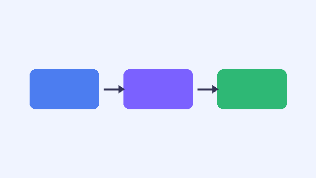

<!-- layout: section -->
# 1. 왜 필요한가

---

# 기존 방식의 문제
- 슬라이드를 손으로 만들면 **내용**과 *디자인*이 섞인다
- 디자인을 바꾸려면 모든 슬라이드를 다시 손봐야 한다
- 버전 관리가 어렵다

::: notes
도입부: 청중에게 반복 작업 경험을 물어본다.
:::

---

# officedocs의 접근
1. 내용은 마크다운 텍스트로 작성
2. 디자인은 PPTX 템플릿이 담당
3. `officedocs build` 한 번으로 재생성

---

<!-- layout: two-content -->
# 텍스트 vs 슬라이드

::: left
- 작성: 마크다운
- 변경 추적: git diff
- 자동화: CI 파이프라인
:::

::: right
- 결과: 네이티브 도형/표/텍스트
- PowerPoint에서 직접 수정 가능
- 이미지 박제 아님
:::

---

# 지원 기능 요약
| 기능 | 입력 문법 | 결과 개체 |
| --- | --- | --- |
| 글머리 기호 | `- 항목` | 텍스트 자리표시자 |
| 표 | `\| a \| b \|` | 네이티브 표 |
| 그림 | `` | 그림 개체 |
| 노트 | `::: notes` | 발표자 노트 |

---

# 다이어그램도 넣을 수 있다

---

<!-- layout: section -->
# 2. 템플릿 교체

---

# 같은 내용, 다른 디자인
- `-t templates/default.pptx` → 밝은 기본 테마
- `-t templates/dark.pptx` → 어두운 테마
- 사내 공식 템플릿 `.pptx`를 그대로 지정해도 된다

::: notes
데모: 같은 입력으로 두 템플릿 빌드 결과를 비교한다.
:::
